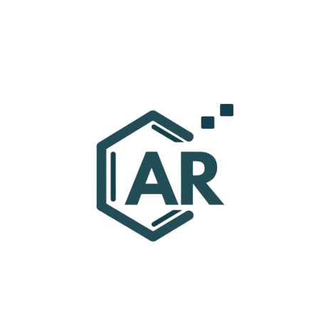
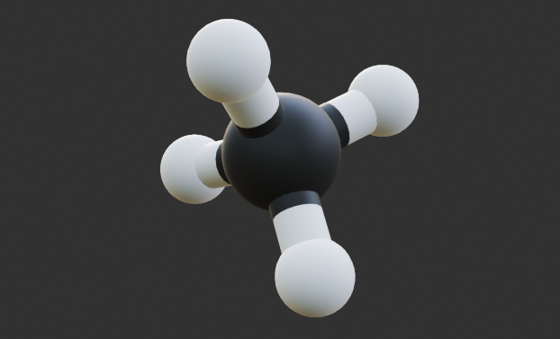
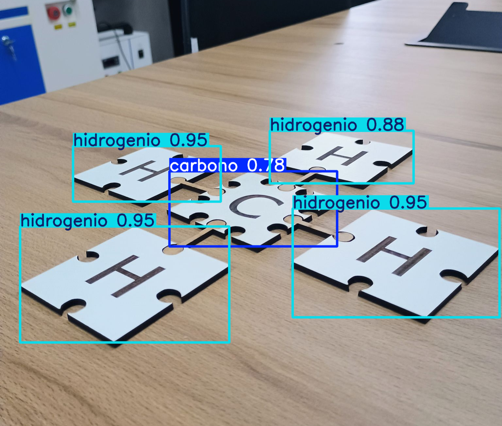

<p align="center">
  
</p>

<h1 align="center">ARChemie</h1>

<h4 align="center">
  Uma ferramenta interativa e acessível para o ensino da Química Orgânica.
</h4>

<br>
<br>

---


<h3 align="center">🧪 · Sobre o projeto</h3>

<br>

O **ARChemie** é uma ferramenta educacional desenvolvida na engine **Unity**, com uso das bibliotecas **ARFoundation** e **Unity Sentis**, voltada ao ensino de Química Orgânica.

<br>

O aplicativo utiliza <strong>Realidade Aumentada (RA)</strong> e um modelo de <strong>Inteligência Artificial (ARGOS)</strong> para reconhecer os elementos das estruturas moleculares montadas a partir de peças físicas e apresentar seus respectivos modelos tridimensionais.

---

<h3 align="center">🛠️ · Softwares & ferramentas</h3>

<br>

<p align="center">
  


</p>

---

<h3 align="center">🧬 · Modelos 3D</h3>

<br>

Os modelos moleculares utilizados pelo ARChemie são desenvolvidos com **Avogadro**, **OpenBabel** e **Blender**, representando as estruturas
identificadas pelo sistema e posteriormente visualizadas em Realidade Aumentada.

<br>

<p align="center">
  
</p>

<p align="center">
  <sub>Modelo 3D da molécula de metano.</sub>
</p>

<p align="center"> Em processo de integração de animações. </p>

---

<h3 align="center">👁️‍🗨️ · ARChemie ARGOS</h3>

<br>

<table>
<tr>
<td width="55%" valign="middle">

<p>
O <strong>ARGOS</strong> é o modelo de <strong>Inteligência Artificial</strong>
desenvolvido para o ARChemie, capaz de reconhecer as peças físicas utilizadas
na montagem das estruturas moleculares.
</p>

<br>

<p>

&nbsp;&nbsp;

&nbsp;&nbsp;

</p>

</td>

<td width="45%" align="center" valign="middle">

</td>
</tr>
</table>

---

<h3 align="center">⚙️ · Como funciona</h3>

<br>

<p align="center">
  <mark>Câmera → ARGOS → Estrutura → Modelo 3D → Realidade Aumentada</mark>
</p>

<br>

O aplicativo utiliza a câmera do dispositivo para capturar as peças físicas.
O <strong>ARGOS</strong> realiza o reconhecimento dos elementos presentes na
imagem e o sistema interpreta a estrutura molecular identificada. A partir
dessa identificação, o modelo 3D correspondente é carregado e apresentado
em <strong>Realidade Aumentada</strong>.

---

### Requisitos


- <mark>Unity 6000.4.4f1</mark>
- Dispositivo Android compatível com <mark>ARCore</mark>
- Git
  
<br>

### Instalação

1. Clone o repositório:

```bash
git clone https://github.com/Dudu-PJ/ARChemie-2026.git
```

2. Abra o projeto pelo <mark>Unity Hub</mark> utilizando a **versão 6000.4.4f1 do Unity.**
3. Conecte um dispositivo Android compatível com ARCore.
4. Compile e execute o aplicativo.

---

<p align="center">
  Desenvolvido por <br> <strong>Guilherme Colissi Martins</strong> &nbsp; & &nbsp; <strong>Eduardo Petri Johann</strong>
</p>

<p align="center">
  <mark>IFRS · Campus Osório · 2026</mark>
</p>
